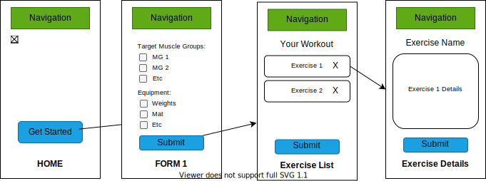

# FITFIX | fitness routine generator

**By: Ella Tanttu**

---

## **Technologies Used**

- _React Native_
- _Expo_
- [React Navigation](https://reactnavigation.org/)
- [React hook form v7](https://react-hook-form.com/get-started)
- _Xcode_
- _npm_
- _PropTypes_
- [REST API Wger](https://wger.de/en/software/api)
- _Postman_
- _axios_
- _native-base_

---

## **Description**

_fitfix will return a tailored workout routine for a user based on the specific variables that user feeds into the site. These variables might include factors such as time limit, exercise equipment available, focus muscle groups, weighted/bodyweight._

### MVP

- Two form submissions returns one workout session
- Return info is based on available equipment & muscle groups to target
- Returned session data uses REST API Wger via Fetch()
- Styling: using React Native built-in styling functionality
- Navigation: React Navigation

### Stretch Goals

- User Authentication -> logging workouts, rating, increasing difficulty over time
- in-app timer
- further customization based on user details (age, weight, etc.)

---

## **Components**

---

## **Setup/Installation Requirements**

- _React version 3.2.0_

### Basic Setup

- Clone the [GitHub repository](https://github.com/ellajtanttu/fitFix)
- From the main project directory, run `npm install` in the terminal to load necessary plugins and packages.
- Run `npm install --save-exact react-scripts@3.2.0` to install React version 3.2.0
- Run `npm run start` to start the application.

## **Known Bugs**

_None at this time_

## **License**

_[MIT](https://opensource.org/licenses/MIT)_
Copyright (c) _2022 Ella Tanttu_

## **Support and Contact Details**

_[ellajtanttu@gmail.com](mailto:ellajtanttu@gmail.com)_
