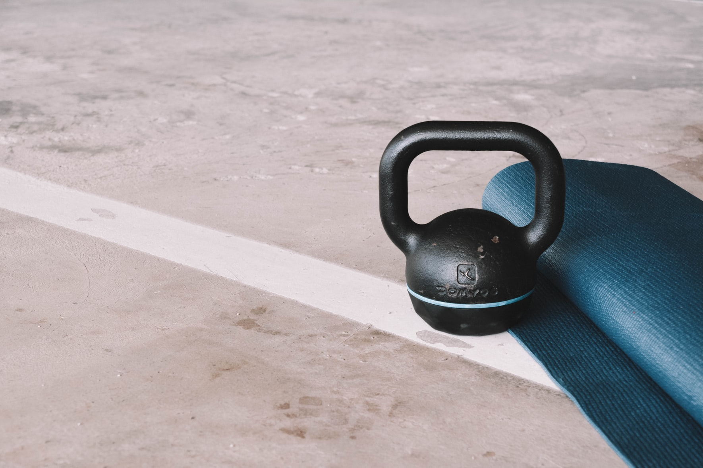

## FITFIX | fitness routine generator
**By: Ella Tanttu**

---

_fitfix will return a tailored workout routine for a user based on the specific variables that user feeds into the site. These variables might include factors such as time limit, exercise equipment available, focus muscle groups, weighted/bodyweight._

---
### MVP
- One form submission returns one workout session
- Session is based on time limit, equipment, muscle groups targeted, and t/f weights

---
### Tools & Technologies
- Vanilla Javascript
- [REST API Wger](https://wger.de/en/software/api)
- Bootstrap
- HTML 5
- CSS 3
- Postman

---

### Stretch Goals
- User Authentication -> logging workouts, rating, increasing difficulty over time
- in-app timer
- further customization based on user details (age, weight, etc.)